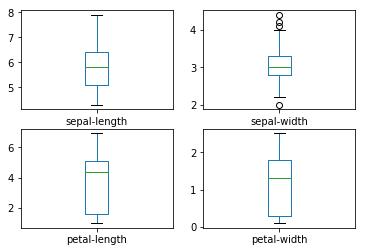
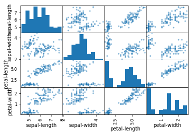

```python
import pandas as pd
from pandas.plotting import scatter_matrix
import matplotlib.pyplot as plt
from sklearn import model_selection
from sklearn.metrics import classification_report
from sklearn.metrics import confusion_matrix
from sklearn.metrics import accuracy_score
from sklearn.neighbors import KNeighborsClassifier
```

Upload data, summary statistics, boxplots showing outliers, scatterplots showind relationship amongst variables


```python
url = "https://archive.ics.uci.edu/ml/machine-learning-databases/iris/iris.data"
names = ['sepal-length', 'sepal-width', 'petal-length', 'petal-width', 'class']
data = pd.read_csv(url, names=names)

print(data.describe())

data.plot(kind='box', subplots=True, layout=(2,2), sharex=False, sharey=False)
plt.show()

scatter_matrix(data)
plt.show()

```

           sepal-length  sepal-width  petal-length  petal-width
    count    150.000000   150.000000    150.000000   150.000000
    mean       5.843333     3.054000      3.758667     1.198667
    std        0.828066     0.433594      1.764420     0.763161
    min        4.300000     2.000000      1.000000     0.100000
    25%        5.100000     2.800000      1.600000     0.300000
    50%        5.800000     3.000000      4.350000     1.300000
    75%        6.400000     3.300000      5.100000     1.800000
    max        7.900000     4.400000      6.900000     2.500000








KNN training and cross validation


```python
array = data.values
X = array[:,0:4]
Y = array[:,4]
validation_size = 0.20
seed = 7
X_train, X_validation, Y_train, Y_validation = model_selection.train_test_split(X, Y, test_size=validation_size, random_state=seed)

scoring = 'accuracy'

model=KNeighborsClassifier(weights="distance")


kfold = model_selection.KFold(n_splits=10, random_state=seed)
cv_= model_selection.cross_val_score(model, X_train, Y_train, cv=kfold, scoring=scoring)
print("accuracy %f " % (cv_.mean()))
```

    accuracy 0.983333 


```python
model.fit(X_train, Y_train)
predictions = model.predict(X_validation)
print(accuracy_score(Y_validation, predictions))
print(classification_report(Y_validation, predictions))
```

    0.9
                     precision    recall  f1-score   support
    
        Iris-setosa       1.00      1.00      1.00         7
    Iris-versicolor       0.85      0.92      0.88        12
     Iris-virginica       0.90      0.82      0.86        11
    
        avg / total       0.90      0.90      0.90        30
    

